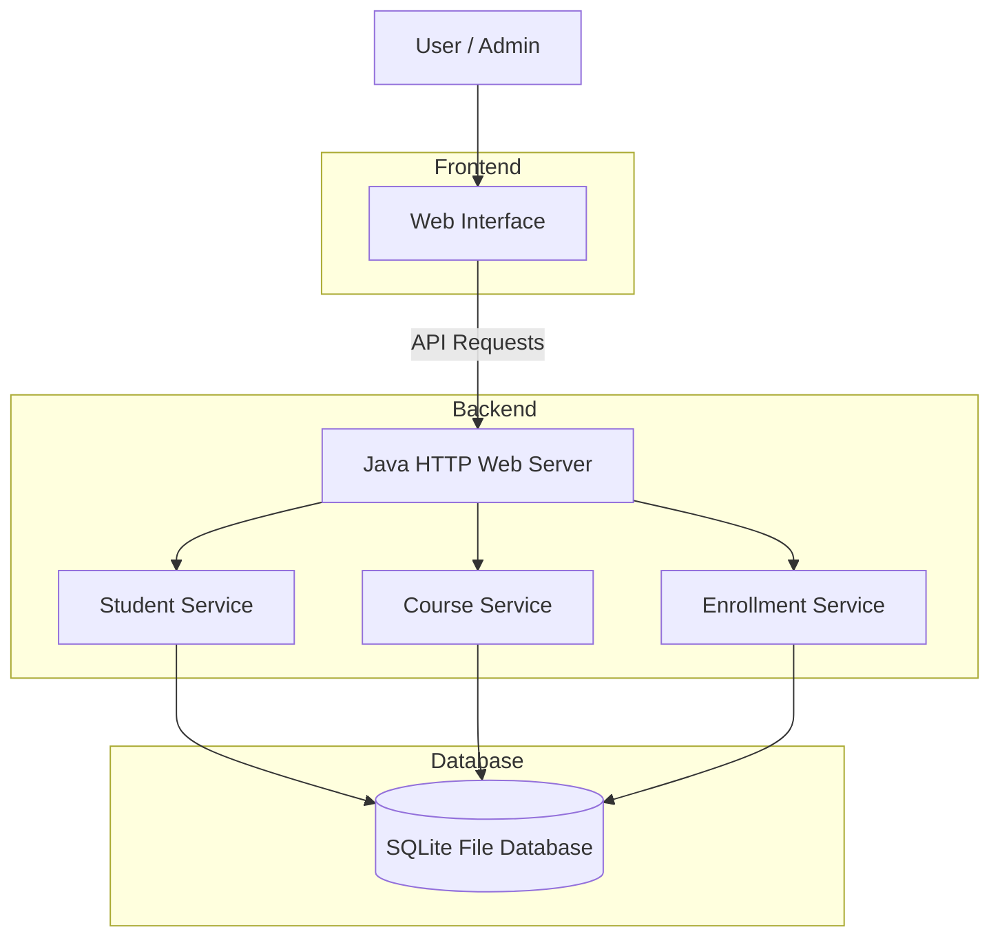
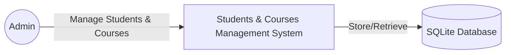
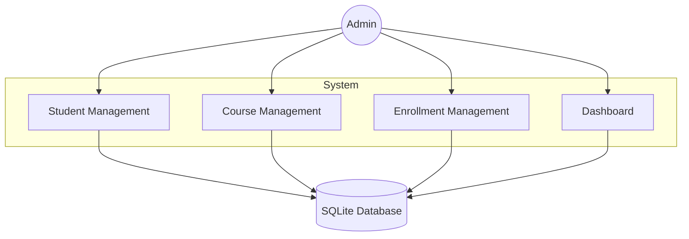
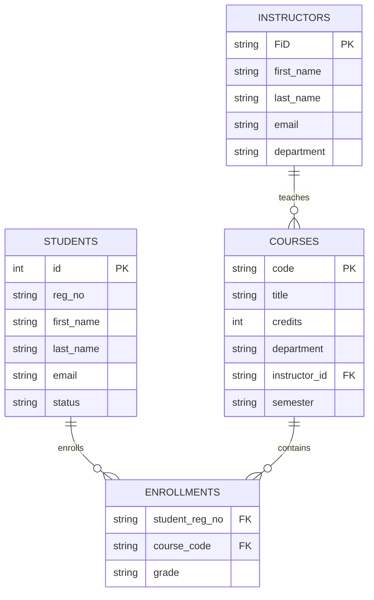
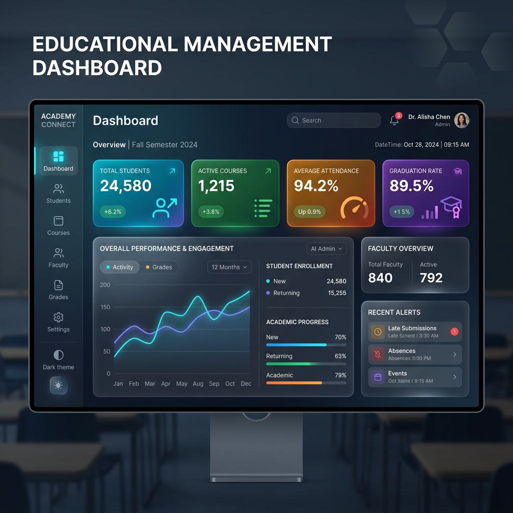
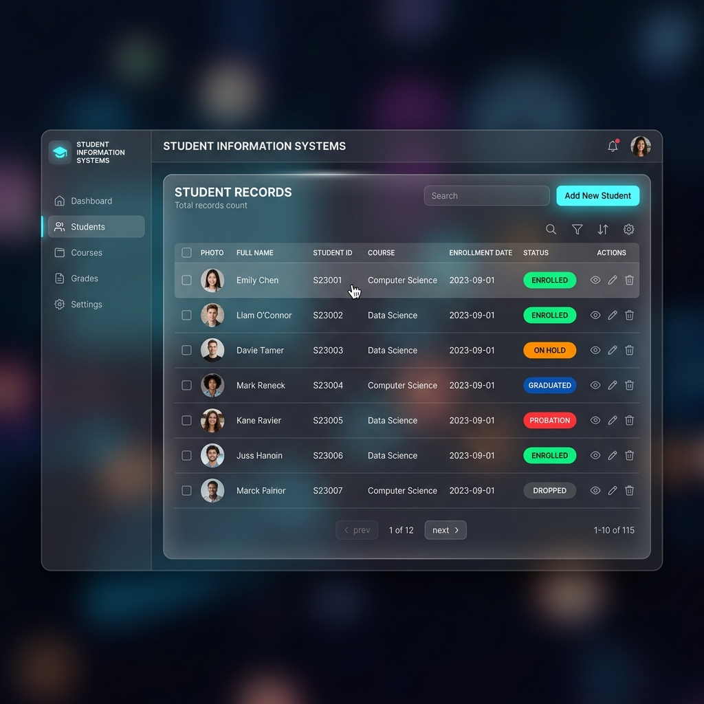

# 🎓 Students and Courses Management System

A modern and efficient **Students and Courses Management System (SCMS)** designed to streamline academic operations such as student management, course handling, enrollments, and administrative workflows.

This project provides a centralized platform for managing educational data with a clean interface and structured backend architecture.

---

# 📌 Table of Contents

- [Overview](#-overview)
- [Features](#-features)
- [Tech Stack](#-tech-stack)
- [System Architecture](#️-system-architecture)
- [Data Flow Diagram](#-complete-data-flow-diagram)
- [Database Design](#️-database-er-diagram)
- [Project Structure](#-project-structure)
- [Installation Guide](#️-installation-guide)
- [Database Setup](#️-database-setup)
- [Running the Project](#️-running-the-project)
- [Screenshots](#-screenshots)
- [Future Enhancements](#-future-enhancements)
- [Testing](#-testing)
- [Contributing](#-contributing)
- [License](#-license)
- [Author](#-author)

---

# 📖 Overview

The **Students and Courses Management System** is a web-based application developed to simplify the management of:

- Student records
- Course details
- Enrollments
- Academic administration

The system helps administrators efficiently organize and maintain academic data while providing users with a smooth, scalable, and beautifully designed glassmorphism experience.

---

# ✨ Features

## 👨‍🎓 Student Management
- Add new students via modern floating-label forms
- View all student records
- Track student statuses via intuitive, colorful badges

## 📚 Course Management
- Create new courses
- View course details and credits
- Assign courses to specific departments and semesters

## 📝 Enrollment System
- Enroll students in courses
- Manage student-course relationships
- Track registered courses

## 📊 Dashboard
- Real-time overview of metrics
- Academic statistics (Total Students, Active Courses, Total Enrollments)
- Interactive hover effects and quick access to system modules

## 🗄️ Database Operations
- Efficient file-based CRUD operations
- Zero-configuration auto-setup schema
- Relational database design utilizing Java JDBC

---

# 🛠️ Tech Stack

| Technology | Purpose |
|---|---|
| **HTML5** | Frontend Structure |
| **CSS3** | Glassmorphism Styling & Animations |
| **Vanilla JS** | Frontend Interactivity & API Fetching |
| **Java SE 11+** | Backend Server (`com.sun.net.httpserver`) |
| **SQLite** | Local File-Based Database Management |
| **JDBC** | Database Connectivity |

---

# 🏗️ System Architecture



---

# 🔄 Complete Data Flow Diagram

## Level 0 DFD



---

## Level 1 DFD



---

# 🗃️ Database ER Diagram



---

# 📂 Project Structure

```bash
Campus-Course-Records-Manager/
│
├── bin/                       # Compiled Java .class files
├── lib/                       # Dependencies
│   └── sqlite-jdbc-3.36.0.3.jar
│
├── public/                    # Frontend UI Assets
│   ├── css/
│   │   └── style.css
│   ├── js/
│   │   └── app.js
│   └── index.html
│
├── src/                       # Backend Java Source Code
│   └── edu/ccrm/
│       ├── config/            # Application configuration
│       ├── domain/            # POJOs (Student, Course, etc)
│       ├── exception/         # Custom exceptions
│       ├── io/                # Database Manager & Initializer
│       ├── service/           # Business logic
│       ├── util/              # Utilities (JSON parsing)
│       └── web/               # CCRMWebServer & API Handlers
│
├── database_setup.sql         # Initial Schema Script
└── README.md
```

---

# ⚙️ Installation Guide

## 1️⃣ Clone Repository

```bash
git clone https://github.com/udityamerit/Students-and-Courses-Management-System.git
```

## 2️⃣ Navigate to Project Directory

```bash
cd Students-and-Courses-Management-System
```

## 3️⃣ Prerequisites

Ensure you have **Java Development Kit (JDK) 11** or higher installed. You **do not** need XAMPP, WAMP, or an external MySQL server, as this project uses a highly efficient, self-contained **local SQLite database**.

---

# 🗄️ Database Setup

You **do not need to manually create the database** or install phpMyAdmin! 

The system utilizes an automated initialization script. When you run the Java backend for the first time, it will automatically:
1. Create a local `app-data/ccrm.db` SQLite file.
2. Execute the `database_setup.sql` script to create the necessary tables.
3. Import initial seed data if available.

---

# ▶️ Running the Project

## Step 1: Compile the Java Backend
Navigate to the project's root directory and run the following command to compile the source code:

```bash
javac -d bin -cp "lib/sqlite-jdbc-3.36.0.3.jar" src/edu/ccrm/config/*.java src/edu/ccrm/domain/*.java src/edu/ccrm/exception/*.java src/edu/ccrm/io/*.java src/edu/ccrm/service/*.java src/edu/ccrm/util/*.java src/edu/ccrm/web/*.java src/edu/ccrm/web/handler/*.java
```

## Step 2: Start the Server
Start the local HTTP web server and connect it to the SQLite database:

```bash
java -cp "bin;lib/sqlite-jdbc-3.36.0.3.jar" edu.ccrm.web.CCRMWebServer
```

## Step 3: Access the Application
Open your modern web browser and navigate to:
```bash
http://localhost:8080
```

---

# 📸 Screenshots

## 🏠 Dashboard


---

## 👨‍🎓 Student Module


---

## 📚 Forms & Data Entry


---

# 🚀 Future Enhancements

* Attendance Management
* Result and Grading Workflows
* Email Notifications
* Student Analytics Dashboard
* JWT Authentication & Role-Based Access Control
* Advanced Data Exporting (PDF/Excel)
* Responsive Mobile UI Enhancements
* AI-Based Performance Prediction

---

# 🧪 Testing

## Manual Testing

* Student & Course CRUD Operations
* Enrollment Validation
* Database Persistence Check
* UI Responsiveness & Browser Caching Testing

## Suggested Future Testing

* Unit Testing (JUnit)
* REST API Testing (Postman)
* Security Testing

---

# 🌐 Deployment

Because this project uses an embedded Java HTTP server and an SQLite database file, it can easily be deployed on containerized platforms or virtual private servers (VPS) such as:

* Render (Dockerized)
* Railway
* AWS EC2
* DigitalOcean Droplets

---

# 🤝 Contributing

Contributions are welcome!

## Contribution Steps

1. Fork the repository
2. Create your feature branch (`git checkout -b feature-name`)
3. Commit changes (`git commit -m "Added new feature"`)
4. Push to branch (`git push origin feature-name`)
5. Open Pull Request

---

# 📜 License

This project is licensed under the MIT License.

---

# 👨‍💻 Author

### Uditya Narayan Tiwari

## 🌐 Portfolio
[https://udityanarayantiwari.netlify.app/](https://udityanarayantiwari.netlify.app/)

## 💼 LinkedIn
[https://www.linkedin.com/in/uditya-narayan-tiwari-562332289/](https://www.linkedin.com/in/uditya-narayan-tiwari-562332289/)

## 💻 GitHub
[https://github.com/udityamerit](https://github.com/udityamerit)

## 📚 Knowledge Base
[https://udityaknowledgebase.netlify.app/](https://udityaknowledgebase.netlify.app/)

---

# 📞 Contact

For any queries or collaboration opportunities:
📧 Contact via LinkedIn or GitHub

---

# ⭐ Support

If you found this project useful:

* ⭐ Star the repository
* 🍴 Fork the project
* 📢 Share with others

---

# 🔗 Repository Link

[https://github.com/udityamerit/Students-and-Courses-Management-System](https://github.com/udityamerit/Students-and-Courses-Management-System)
